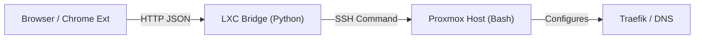

# GYTECH Proxmox Traefik Bridge

  

Herramienta de automatización personalizada para **GYTECH**. Esta solución inyecta un botón nativo en la interfaz web de Proxmox VE que permite exponer servicios de contenedores LXC a través de Traefik y DNS con un solo clic.

---

## 🏗️ Arquitectura

El sistema funciona mediante tres componentes conectados:

1. **Chrome Extension (Frontend):** Inyecta el botón "🚀 GYTECH Expose" en la UI de Proxmox. Detecta el ID y Nombre del contenedor y solicita el puerto interno.
2. **LXC Bridge (Middleware):** Un servidor ligero en Python que recibe la petición HTTP de la extensión y la traduce a un comando de sistema seguro.
3. **Proxmox Host (Backend):** Ejecuta el script Bash final que configura las reglas de Traefik/DNS.



---

## 📂 Estructura del Repositorio

```plaintext
gytech-proxmox-traefik-bridge/
├── chrome-extension/          # Código fuente de la extensión
│   ├── manifest.json
│   ├── content.js
│   └── icons/
├── lxc-bridge/                # Servidor intermedio (Python)
│   ├── gytech_bridge.py
│   └── gytech-bridge.service
└── proxmox-host/              # Script de ejecución final
    └── gytech-expose.sh
```

---

## 🚀 Instalación y Despliegue

Sigue estos pasos en orden para configurar el entorno completo.

### Paso 1: Configurar el Servidor Docker/Traefik (Solo una vez)

Para que Traefik detecte los archivos generados por el script, debes configurar la carga dinámica mediante carpeta.

#### A. Estructura de Carpetas

Ejecuta esto en tu servidor Docker dentro de la carpeta traefik:

```bash
mkdir -p ./data/dynamic
# Si tienes un config actual, muévelo:
mv ./data/config.yml ./data/dynamic/
```

#### B. Modificar docker-compose.yaml

Edita tu archivo y actualiza la sección `volumes` del servicio Traefik:

```yaml
services:
  traefik:
    # ... otras configuraciones ...
    volumes:
      - /etc/localtime:/etc/localtime:ro
      - /var/run/docker.sock:/var/run/docker.sock:ro
      - ./data/traefik.yml:/traefik.yml:ro
      - ./data/acme.json:/acme.json

      # 🟢 NUEVO: Mapeo de carpeta dinámica
      - ./data/dynamic:/dynamic_conf
```

#### C. Modificar data/traefik.yml

Dile a Traefik que vigile el directorio `/dynamic_conf`:

```yaml
providers:
  file:
    directory: /dynamic_conf  # <-- IMPORTANTE: usar directory, no filename
    watch: true
```

#### D. Aplicar cambios

```bash
docker compose up -d --force-recreate
```

### Paso 2: Configurar SSH (Proxmox → Docker)

El nodo Proxmox debe poder enviar archivos al servidor Docker sin contraseña. Ejecuta esto **en la consola de Proxmox** (solo una vez):

```bash
# Generar llave (si no existe) -> Enter a todo
ssh-keygen -t rsa

# Copiar llave al servidor Docker (pedirá password una vez)
ssh-copy-id root@10.10.10.232
```

### Paso 3: Configurar el Proxmox Host (Servidor Físico)

1. Accede por SSH a tu nodo Proxmox (root@pam).

2. Copia el script `proxmox-host/gytech-expose.sh` a `/root/`.

3. Dale permisos de ejecución:

```bash
chmod +x /root/gytech-expose.sh
```

4. (Opcional) Edita el script para ajustar tus rutas de Traefik o dominio base si es necesario.

### Paso 4: Configurar el LXC Bridge (Contenedor Intermedio)

Este contenedor actúa como puente de seguridad.

1. Copia el script `lxc-bridge/gytech_bridge.py` a `/root/` en el contenedor.

2. Edita `gytech_bridge.py` y verifica que la variable `PROXMOX_HOST` apunte a la IP de tu nodo Proxmox.

3. Configura el servicio systemd para que inicie automáticamente:
   - Copia `lxc-bridge/gytech-bridge.service` a `/etc/systemd/system/`.
   - Recarga demonios y activa el servicio:

```bash
systemctl daemon-reload
systemctl enable --now gytech-bridge
```

4. **IMPORTANTE (SSH Keys):** El contenedor LXC debe poder conectarse por SSH al Host sin contraseña.

```bash
# En la consola del LXC:
ssh-keygen -t rsa
ssh-copy-id root@<IP_DEL_PROXMOX_HOST>
```

### Paso 5: Instalar la Extensión de Chrome

1. Abre Google Chrome y ve a `chrome://extensions`.

2. Activa el **"Modo de desarrollador"** (esquina superior derecha).

3. Haz clic en **"Cargar descomprimida"** (Load unpacked).

4. Selecciona la carpeta `chrome-extension` de este repositorio.

5. **Configuración:** Si cambia la IP del contenedor LXC, edita la constante `BRIDGE_URL` en el archivo `content.js` y recarga la extensión.

---

## 💻 Uso

### Opción 1: Interfaz Web (Extensión de Chrome)

1. Entra a la interfaz web de Proxmox.

2. Selecciona cualquier VM o Contenedor (LXC) en el menú izquierdo.

3. Verás un botón **"🚀 GYTECH EXPOSE"** en la barra superior (junto a Start/Shutdown).

4. Haz clic en el botón.

5. Confirma el **Nombre del Servicio** (subdominio) y el **Puerto Interno**.

6. Haz clic en **EJECUTAR**.

7. El sistema te devolverá la URL generada (ej: `https://influxdb.local.gytech.com.pe`).

### Opción 2: Línea de Comandos (Script Manual)

Ejecuta el script desde Proxmox cada vez que crees un nuevo LXC.

**Sintaxis:** `./gytech-expose.sh <VMID> <NOMBRE> [PUERTO]`

**Ejemplos:**

#### 1. Servicio Web Estándar (Puerto 80)

```bash
./gytech-expose.sh 105 wiki
```

_Crea:_ `https://wiki.local.gytech.com.pe` apuntando al puerto 80 del LXC.

#### 2. Servicio con Puerto Personalizado

```bash
./gytech-expose.sh 106 portainer 9000
```

_Crea:_ `https://portainer.local.gytech.com.pe` apuntando al puerto 9000 del LXC.

---

## 🔧 Solución de Problemas

### Error "Network Error" en la extensión:

- Verifica que la IP en `content.js` sea la correcta del LXC.
- Asegúrate de estar accediendo a Proxmox vía HTTPS y que el navegador no esté bloqueando contenido mixto (si el bridge es HTTP).

### El botón no aparece:

- Recarga la página con F5.
- Asegúrate de haber seleccionado una VM/CT.

### Error "Permission denied" en el log:

- Verifica las llaves SSH entre el LXC y el Host (`ssh root@<host> date` desde el LXC debería funcionar sin password).
- Verifica las llaves SSH entre Proxmox y Docker (`ssh root@10.10.10.232 date` desde Proxmox debería funcionar sin password).

### Traefik no detecta los cambios:

- Verifica que el directorio `/dynamic_conf` esté correctamente montado en el contenedor.
- Revisa los logs de Traefik: `docker logs traefik`
- Asegúrate de que `watch: true` esté configurado en `traefik.yml`

---

## 📝 Licencia

Propiedad de **GYTECH**. Uso interno para automatización de infraestructura.
