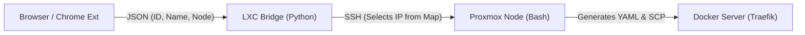

# GYTECH Proxmox Traefik Bridge

  

Herramienta de automatización personalizada para **GYTECH**. Esta solución inyecta un botón nativo en la interfaz web de Proxmox VE que permite exponer servicios de contenedores LXC a través de Traefik y DNS con un solo clic, soportando **múltiples nodos en clúster**.

---

## 🏗️ Arquitectura

El sistema funciona mediante una cadena de componentes distribuidos:

1.  **Chrome Extension (Frontend):** Inyecta el botón "🚀 GYTECH Expose". Detecta inteligentemente el **ID**, **Nombre** y el **Nodo** (ej: `proxmox2`) donde reside el contenedor.
2.  **LXC Bridge (Middleware):** Servidor Python que recibe la petición, busca la IP del nodo correspondiente en su mapa interno y se conecta vía SSH.
3.  **Proxmox Node (Worker):** Ejecuta el script Bash localmente, genera la configuración YAML y la envía vía **SCP** al servidor central de Docker/Traefik.
4.  **Docker Server (Backend):** Traefik detecta el nuevo archivo en caliente y expone el servicio.

```mermaid
graph LR
    A["Browser / Chrome Ext"] -- "JSON (ID, Name, Node)" --> B["LXC Bridge (Python)"]
    B -- "SSH (Selects IP from Map)" --> C["Proxmox Node (Bash)"]
    C -- "Generates YAML & SCP" --> D["Docker Server (Traefik)"]

```
    📂 Estructura del Repositorio
Plaintext

gytech-proxmox-traefik-bridge/
├── chrome-extension/          # Código fuente de la extensión
│   ├── manifest.json
│   ├── content.js
│   └── icons/
├── lxc-bridge/                # Servidor intermedio (Python)
│   ├── gytech_bridge.py       # Configurar NODE_MAP aquí
│   └── gytech-bridge.service
└── proxmox-host/              # Script de ejecución final
    └── gytech-expose.sh       # Instalar en TODOS los nodos físicos
🚀 Instalación y Despliegue
Sigue estos pasos en orden para configurar el entorno completo.

Paso 1: Configurar el Servidor Docker/Traefik (Destino Final)
Traefik debe estar configurado para leer archivos dinámicos desde una carpeta.

A. En tu docker-compose.yaml (Servicio Traefik): Asegúrate de tener mapeado el volumen para configuraciones dinámicas:

YAML

    volumes:
      - ./data/dynamic:/dynamic_conf  # 🟢 Carpeta donde llegarán los archivos
B. En tu traefik.yml: Habilita el proveedor de archivos:

YAML

providers:
  file:
    directory: /dynamic_conf
    watch: true
Paso 2: Configurar los Nodos Proxmox (Físicos)
Realiza esto en CADA NODO de tu clúster (proxmox, proxmox2, etc.).

Copia el script proxmox-host/gytech-expose.sh a /root/.

Dale permisos de ejecución: chmod +x /root/gytech-expose.sh

Edita el script y configura la IP de tu Docker Server:

Bash

TRAEFIK_HOST="root@10.10.10.232"
Configurar SSH hacia Docker: El nodo Proxmox debe poder enviar archivos al Docker Server sin contraseña.

Bash

# En la consola de CADA nodo Proxmox:
ssh-copy-id root@10.10.10.232
Paso 3: Configurar el LXC Bridge (Intermediario)
Este contenedor orquesta las peticiones.

Copia lxc-bridge/gytech_bridge.py a /root/ en el contenedor.

Configurar Mapa de Nodos: Edita el archivo .py y actualiza la variable NODE_MAP con las IPs de tus nodos físicos:

Python

NODE_MAP = {
    "proxmox": "root@10.10.10.200",
    "proxmox2": "root@10.10.10.201"
}
Instala y activa el servicio systemd (gytech-bridge.service).

Configurar SSH hacia los Nodos: El LXC debe poder entrar a todos los nodos físicos.

Bash

# En la consola del LXC:
ssh-copy-id root@10.10.10.200
ssh-copy-id root@10.10.10.201
Paso 4: Instalar la Extensión de Chrome
Carga la carpeta chrome-extension en modo desarrollador (chrome://extensions).

Si la IP del LXC cambia, actualiza BRIDGE_URL en content.js.

💻 Uso
Vía Interfaz Web (Recomendado)
Navega a la web de Proxmox.

Selecciona un contenedor en cualquier nodo.

Clic en "🚀 GYTECH EXPOSE".

Confirma nombre y puerto.

¡Listo! La URL aparecerá en pantalla y el servicio estará activo en segundos.

Vía Terminal (Debugging)
Puedes ejecutar el script manualmente desde el nodo donde vive el contenedor:

Bash

# Uso: ./gytech-expose.sh <VMID> <NOMBRE> <PUERTO>
./gytech-expose.sh 103 frigate 5000
🔧 Solución de Problemas Clásicos
Error: "Permission denied (publickey)"

Si falla el Bridge: Faltan llaves SSH del LXC -> Nodos Proxmox.

Si falla el Script: Faltan llaves SSH de los Nodos Proxmox -> Docker Server.

El botón dice "Éxito" pero no funciona la URL:

Revisa si el archivo .yml llegó al servidor Docker: ls /data/traefik/data/dynamic.

Si el archivo está ahí, revisa logs de Traefik: docker logs traefik.

Error al cambiar de Nodo:

Asegúrate de que el script gytech-expose.sh existe en el nuevo nodo y tiene permisos +x.

Verifica que agregaste el nuevo nodo al NODE_MAP en el script de Python.

📝 Licencia
Propiedad de GYTECH. Uso interno para automatización de infraestructura.
